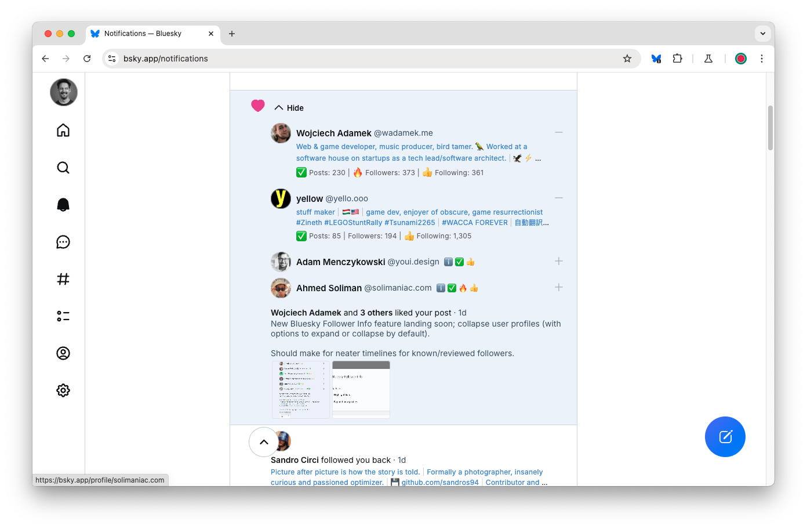

# Bluesky Follower Info

> A Chrome extension which displays new followers' profile descriptions and stats in the notifications feed

## Features

### Content

The extension displays:

- profile description (tidied)
- posts, followers and following counts
- icons for:
  - 📝 posted
  - ✅ engaged (more than 25 posts)
  - 🔥 popular (more followers than following)
  - 👍 following
- Newer followers (< 2 weeks) shown in blue, older ones in grey
- a blue background for notification summaries (so you don't miss them)

> Note: only on-screen notifications are fetched, then cached (and refreshed if > 1 week old)

Profiles are also collapsible:

- profiles are expanded by default
- profiles remember their collapsed / expanded state by user
- collapsed profiles also show icons for quick reference

### Options

The options page lets you configure:

- profile (truncate text, include emojis, expanded state)
- locations (feed, lists, follows, reposts, likes, highlighted lists)
- emojis (profile, posted, engaged, popular, following)
- thresholds (posted, engaged, stale, old)

### International support

The extension currently supports English, French and Spanish [App Language](https://bsky.app/settings/language) settings.

> To request a new language, please create an issue to help with translations.

## Media

Video:

- [Follow / Unfollow](https://bsky.app/profile/did:plc:n2xk2ztwx5asqq4v6aocd45o/post/3lcn2pyrxe22f)

## Installation

Install from the Chrome Web Store:

- https://chromewebstore.google.com/detail/bluesky-follower-info/fokpfcfpgdlmnbjajbdeofkemfblbnbh

Make sure to reload any open Bluesky pages.
