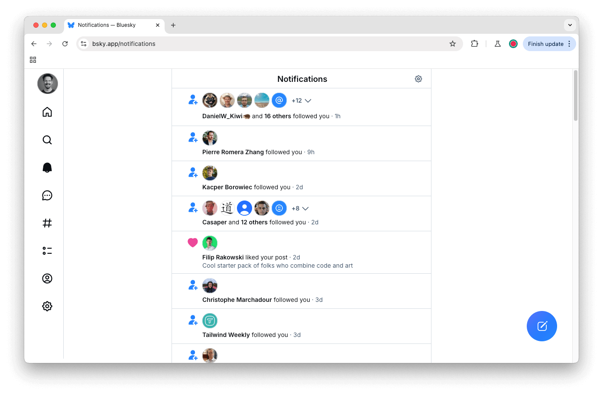
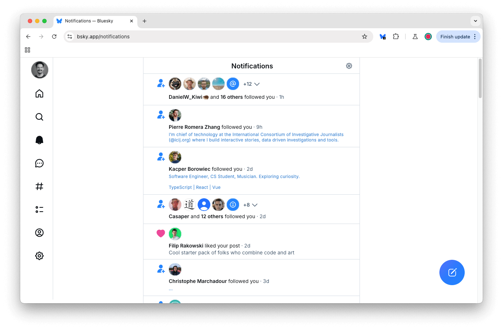
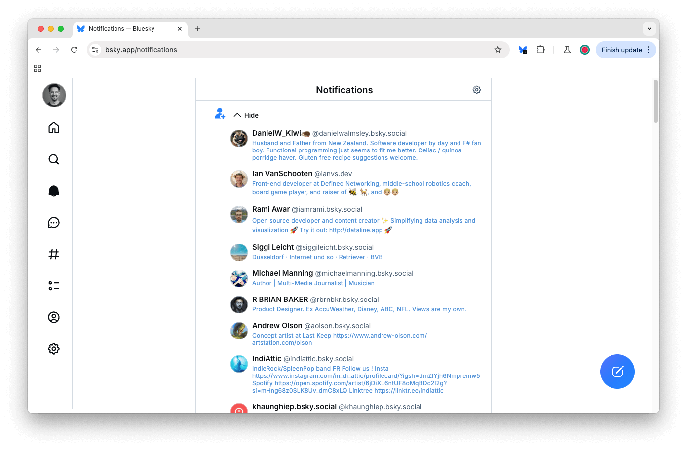
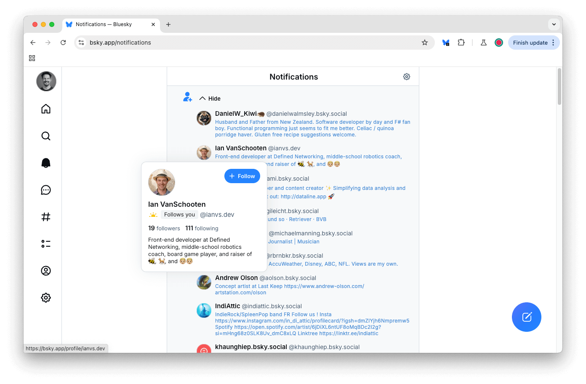

# Bluesky Follower Info

> A Chrome extension which displays new followers' profile descriptions directly in the notifications feed.

## Overview

Normally, the Bluesky feed is just a list of names and handles, with no real information about the follower:

With the extension installed, all follow notifications are augmented with the user's profile description:

This is more apparent in the rolled-down follows list, and makes it much easier to grok who to follow:

If someone looks interesting, just hover over their avatar and click the follow button as normal:

Profiles are loaded on demand as the page loads or scrolls, and descriptions are stored locally so will only be fetched once and will display instantly on reload.

## Installation

Install from the Chrome Web Store:

- https://chromewebstore.google.com/detail/bluesky-follower-info/fokpfcfpgdlmnbjajbdeofkemfblbnbh

Then, reload any open Bluesky pages.
