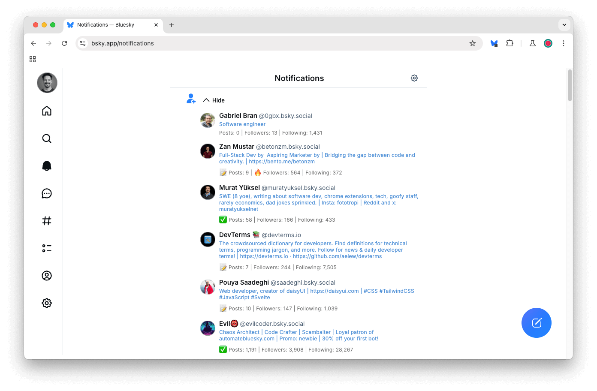

# Bluesky Follower Info

> A Chrome extension which displays new followers' profile descriptions and stats in the notifications feed

## Features

- Profile description
- Posts, followers and following counts
- Icons for:
  - 📝 Posted
  - ✅ Engaged (more than 25 posts)
  - 🔥 Popular (more followers than following)
- Only on-screen notifications are fetched (and refreshed if > 1 week old) 
- Newer followers (< 2 weeks) shown in blue, older in grey

## Installation

Install from the Chrome Web Store:

- https://chromewebstore.google.com/detail/bluesky-follower-info/fokpfcfpgdlmnbjajbdeofkemfblbnbh

Make sure to reload any open Bluesky pages.
